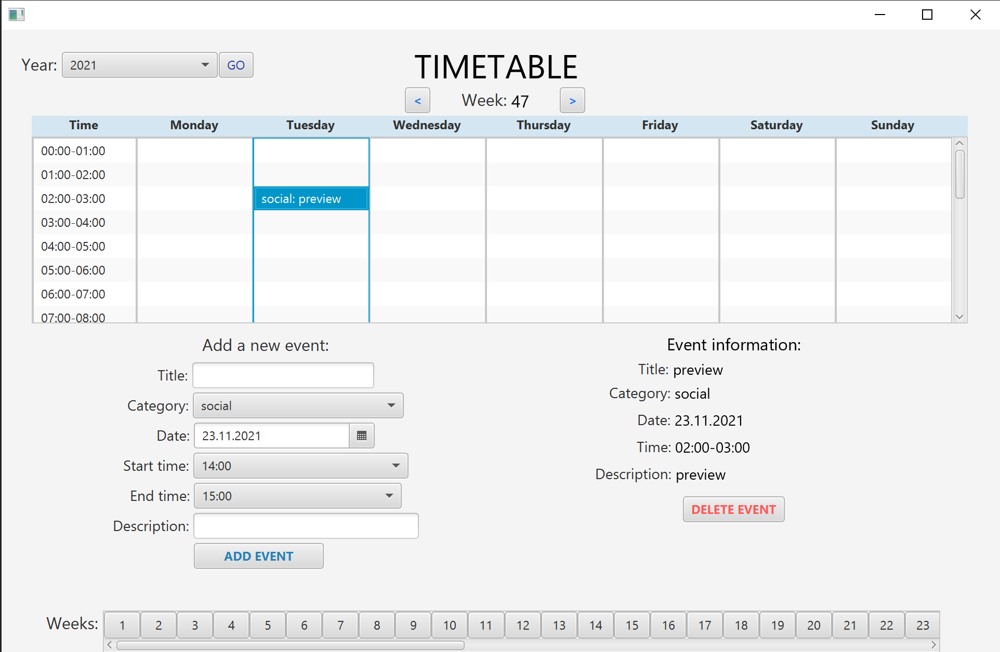

# Instructions for running the application is at the bottom of this readme file.

# timetable 
Timetable [timetable](timetable) is the main folder for our group project in the subject IT1901. 
The goal for our app is for the user to add events, with title, a date, time of day and a description. The event will then appear in a timetable. The user can also choose between several years and weeks, with the right number of weeks in each year. 
In timetable there is a folder for the logic of the app ([core](timetable/core)), and a folder for the user interface ([fxui](timetable/fxui)). 

# Core 
The core logic is implemented in [Timetable.java](timetable/core/src/main/java/timetable/core/Timetable.java). It has methods for adding and removing events from the lists of events.
[Event.java](timetable/core/src/main/java/timetable/core/Event.java) is the event class, and contains gets and sets for an event object. And has methods for making event-objects with title, description, time and day.[User.java](timetable/core/src/main/java/timetable/core/User.java) has methods for adding a timetable to the timetableMap, using a key constructed from the timetable object. 

## Json, serializers and deserializers
Writing and reading from Json files is implemented in [Json.java](timetable/core/src/main/java/timetable/core/Json.java), with the methods read and write. With the read method, the user reads all existing events and timetables with a hierarchy of deserializers; user [UserDeserializer.java](timetable/core/src/main/java/timetable/core/UserDeserializer.java), timetable [TimetableDeserializer.java](timetable/core/src/main/java/timetable/core/TimetableDeserializer.java), event [EventDeserializer.java](timetable/core/src/main/java/timetable/core/EventDeserializer.java). The deserializers gets initialized in [TimetableModuleRead.java](timetable/core/src/main/java/timetable/core/TimetableModuleRead.java). 
The write-method writes all timetables and events for the specific user using a hierarchy of serializers: user [UserSerializer.java](timetable/core/src/main/java/timetable/core/UserSerializer.java), timetable [TimetableSerializer.java](timetable/core/src/main/java/timetable/core/TimetableSerializer.java), event [EventSerializer.java](timetable/core/src/main/java/timetable/core/EventSerializer.java) The serializers gets initialized in [TimetableModuleWrite.java](timetable/core/src/main/java/timetable/core/TimetableModuleWrite.java).
These methods for reading and writing gets called in the controller, and can be visible in the timetable gui.

# fxui 

## Controller 
[AppController.java](timetable/fxui/src/main/java/timetable/ui/AppController.java) is the controller, which combines the core logic with the ui.
It also implements the functionality of the userinterface:
* Adding an event when clicking on the add event button.
* Updating the view so the newest and correct data is always shown.
* Displaying the chosen event information.
* Deleting an event from the view and the user object.
* Connect the 7 listviews to achieve a specific functionality.

## fxml
In [App.fxml](timetable/fxui/src/main/resources/timetable/ui/App.fxml) the GUI for the timetable is implemented. The timetable is made with a pane and ListView for each coloumn. The first coloumn represents the hours of the day and the rest of them represents the days of the week. It also have buttons for each week of the year and it's contained in a scrollpane to save space. The scrollpain shows 52 or 53 week-buttons depending on the chosen year.
There are Textfield-boxes for the user to fill in a title and description. There is a datepicker for choosing a date, and choiceboxes to pick start time and end time. At the bottom there is a button "Add event", which adds the event to the timetable. Each of these items have an id, which is used in the controller.
At the right hand side, an event will show up when it's selected/clicked on in the timetable/listviews. It shows the title, date, time (start and end) and description. The default text when an empty cell is selected is "Click on an event to get more information", and the fields below are empty.
When an event is selected/clicked on, then the corresponding information will show up, as well as a delete event button for deleting the event.

# rest
[rest](timetable/rest) is one of the two folders (together with integrationtests) containing the code to run our rest server.
To start the server (before running the application), write "mvn -pl integrationtests jetty:run -D"jetty.port=8999"" from the timetable folder. To terminate the server, type ctrl+c in the same terminal.

## restapi
[restapi](timetable/rest/src/main/java/timetable/restapi)

[TimetableResource.java](timetable/rest/src/main/java/timetable/restapi/TimetableResource.java)...
[UserService.java](timetable/rest/src/main/java/timetable/restapi/UserService.java) ....

## restserver
[restserver](timetable/rest/src/main/java/timetable/restserver) ....
[Config.java](timetable/rest/src/main/java/timetable/restserver/Config.java)....
[UserMapperProvider.java](timetable/rest/src/main/java/timetable/restserver/UserMapperProvider.java)

# Tests
## core tests
### core
[EventTest.java](timetable/core/src/test/java/timetable/core/EventTest.java) have Junit tests that tests the event class (the constructor and the setters) and it also has exception tests.
[TimetableTest.java](timetable/core/src/test/java/timetable/core/TimetableTest.java) have Junit tests that test the timetable class (the constructor and adding events to the timetable).
[UserTest.java](timetable/core/src/test/java/timetable/core/UserTest.java) have junit tests that tests adding a timetable to a user.

### json
[TimetableModuleTest.java](timetable/core/src/test/java/timetable/json/TimetableModuleTest.java) have junit tests that tests the serializers and desiarlizers. 
[TimetablePersistenceTest.java](timetable/core/src/test/java/timetable/json/TimetablePersistenceTest.java) have junit tests to test TimetablePersistence. 

## fxui tests
[AppTest.java] (timetable\fxui\src\test\java\timetable\ui\AppTest.java) have ui tests that recreates a users behaviour when using the app. There is two test for adding an event and viewing it in the the correct year and week. It also checks that the event was added into the user. There is a test that deletes an added event and checks the listviews and the eventmap before and each deletion to ensure that the delete functionality is working.

## rest tests
..............FYLL inn.....

## Integrationtests
............FYLL inn ....

We also implemnted other tools to check code quality:
* Spotbugs
* Checkstyle
* Jacoco 

We used these tools to check for bugs, errors and test coverage to optimalize the code quality. 

# Trying it out
To try out the projects, cd into the corrosponding folder (timetable).
* "mvn clean install" to get mvn to work when running the project for the first time
* compile with "mvn compile"
* test with "mvn test"
* check test coverage with "mvn test" first, and then "mvn jacoco:report". The coverage is shown in index.html inside target/site/jacoco. There is one for each module core and fxui.
* Start the rest-api server with the command 'mvn -pl integrationtests jetty:run -D"jetty.port=8999"'.
It is advisable to run the server command and the javafx:run command from two different terminals.
* Our relative paths to see what's stored on the server is /user (all timetables) and /user/timetable/weeknumber+year (specific timetable, for example: /user/timetable/472021). Only timetable weeks with events will have information on the site. The others will have a Request failed message. If you are running it with localhost, our relative paths are http://localhost:8999/user and http://localhost:8999/user/timetable/week+year
* At startup there will be some events that are from the rest server, these are in week 47 (2021) and week 39 (2021).
* To terminate the server you can use ctrl+c to stop the terminal where your server is running from.
* run "mvn javfx:run" (inside timetable/fxui) or mvn -pl fxui javafx:run from the timetable folder.
* check code quality with mvn verify

# Shippable product
* The project can be created into an exe file to install the application on your computer.
* Steps to create a shippable product:
1. If you are on windows, if not then skip this step: Download wix311.exe from https://github.com/wixtoolset/wix3/releases/tag/wix3112rtm and run the program an install wix.
2. Run "mvn -pl fxui clean compile javafx:jlink jpackage:jpackage" from the timetable folder. This will create a zip file at timetable\fxui\target\timetablefx.zip and an exe file at timetable\fxui\target\dist\TimetableFX-1.0.0.exe.
3. Install the TimetableFX-1.0.0.exe file. The application/program (timetablefx) will be installed on your computer under programs.
4. start the server by running "mvn -pl integrationtests jetty:run -D"jetty.port=8999"" from the timetable folder.
5. Open the timetablefx program on your computer.

# An image of the apps interface
